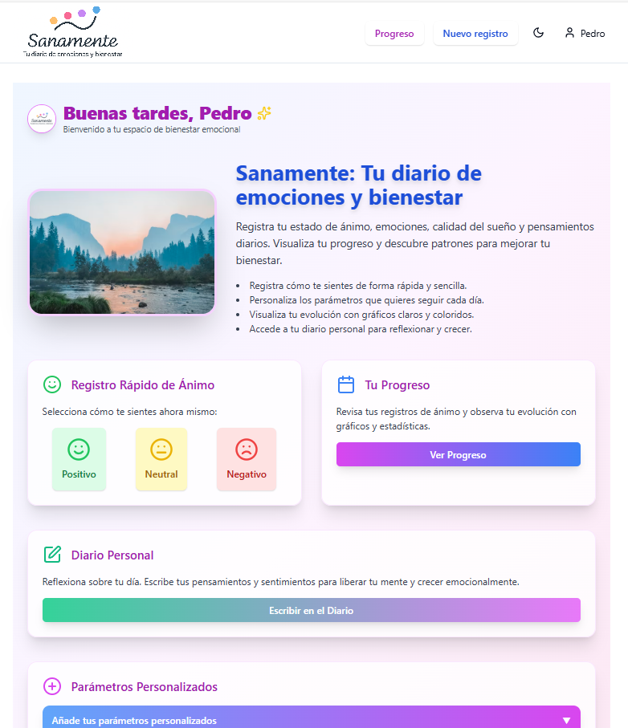
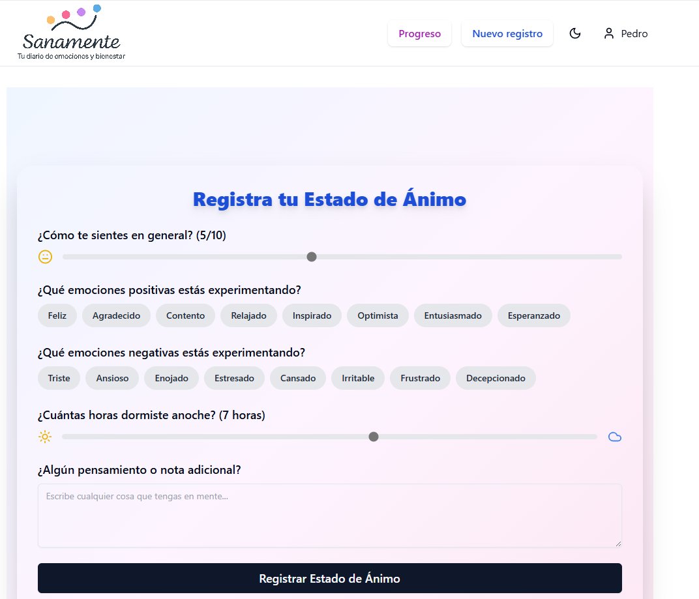
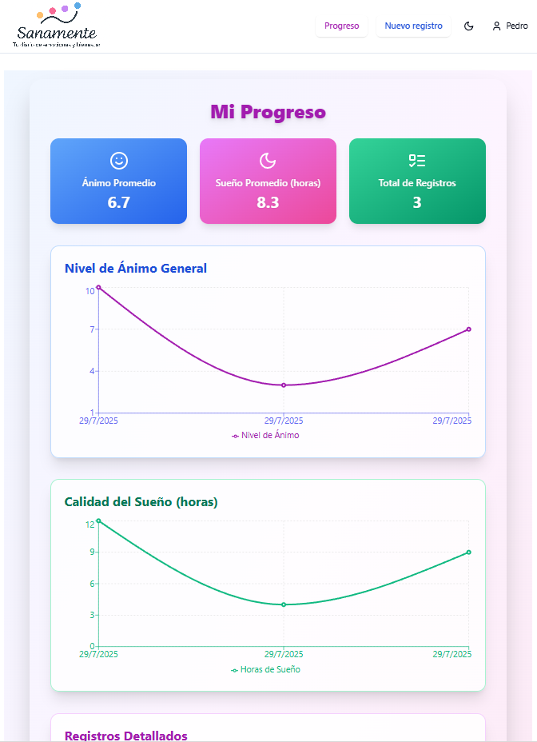

# Sanamente



Sanamente es una aplicación diseñada para ayudarte a cuidar tu salud mental y bienestar emocional. Permite registrar tu estado de ánimo, emociones, calidad del sueño y pensamientos diarios, ofreciendo una visión de tu progreso a lo largo del tiempo.

## Origen del Proyecto

Esta aplicación fue desarrollada utilizando como base el siguiente repositorio boilerplate:

- [Boilerplate Monorepo: React (Vite) + PocketBase](https://github.com/danizd/base-PocketBase-React-Vite)

---

# Boilerplate Monorepo: React (Vite) + PocketBase

Este es un boilerplate para crear aplicaciones web con un frontend de React (usando Vite) y un backend de PocketBase.

## Requisitos Previos

- Node.js (v18+) y npm
- Un sistema operativo compatible con PocketBase (Windows, macOS, Linux)

## Estructura del Proyecto

El proyecto está organizado como un monorepo con las siguientes carpetas:

- `/backend`: Contiene la configuración y los datos de PocketBase.
- `/frontend`: Contiene la aplicación de React (Vite).

## Configuración y Ejecución

### 1. Backend (PocketBase)

PocketBase es un backend de código abierto en un solo archivo ejecutable.

1.  **Descargar PocketBase:**
    - Ve a la [página de descargas de PocketBase](https://pocketbase.io/docs/).
    - Descarga el archivo zip para tu sistema operativo.

2.  **Configurar el Backend:**
    - Crea una carpeta `backend` en la raíz del proyecto.
    - Extrae el contenido del zip descargado dentro de la carpeta `backend`.
    - Deberías tener una estructura similar a:
      ```
      .
      ├── backend/
      │   ├── pocketbase
      │   └── ... (otros archivos de PocketBase)
      └── ...
      ```

3.  **Iniciar el Backend:**
    - Abre una terminal y navega a la carpeta `backend`.
    - Ejecuta el siguiente comando para iniciar el servidor de PocketBase:
      ```bash
      ./pocketbase serve
      ```
    - El servidor se iniciará en `http://127.0.0.1:8090` por defecto.
    - La primera vez, se generará un enlace de instalación que se abrirá automáticamente en el navegador para configurar tu primera cuenta de superusuario (también puedes crearla manualmente mediante ./pocketbase superuser create EMAIL PASS).

4.  **Crear la Colección de Usuarios:**
    - Abre `http://127.0.0.1:8090/_/` en tu navegador para acceder al panel de administración.
    - Crea tu primera cuenta de administrador.
    - Ve a la sección "Collections".
    - La colección `users` ya existe por defecto y está lista para ser usada.

### 2. Frontend (React + Vite)

1.  **Navegar al Frontend:**
    ```bash
    cd frontend
    ```

2.  **Instalar Dependencias:**
    ```bash
    npm install
    ```

3.  **Configurar Variables de Entorno:**
    - Crea un archivo `.env.local` en la raíz de la carpeta `frontend`.
    - Añade la URL de tu backend de PocketBase:
      ```
      VITE_POCKETBASE_URL=http://127.0.0.1:8090
      ```

4.  **Iniciar el Frontend:**
    ```bash
    npm run dev
    ```
    - La aplicación estará disponible en `http://127.0.0.1:5173`.

## Scripts Disponibles

Dentro de la carpeta `frontend`, puedes ejecutar los siguientes scripts:

- `npm run dev`: Inicia el servidor de desarrollo de Vite.
- `npm run build`: Compila la aplicación para producción.
- `npm run preview`: Sirve la aplicación compilada localmente.
- `npm test`: Ejecuta los tests unitarios con Vitest.

## Estructura del Frontend

El frontend sigue una estructura de carpetas por funcionalidad:

- `src/components`: Componentes de React reutilizables.
- `src/contexts`: Contextos de React para el manejo de estado global.
- `src/hooks`: Hooks de React personalizados.
- `src/pages`: Componentes que representan las páginas de la aplicación.
- `src/lib`: Clientes o servicios para interactuar con APIs externas.




"# sanamente

## Copia de Seguridad de Colecciones

Se incluye una copia de seguridad de las colecciones de PocketBase en el directorio `backend/backup_colecciones/`."